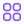

<p align="center">
  
</p>

<h1 align="center">Hydra QR Studio</h1>

<p align="center">
  <b>Professional floating QR Studio — Vanilla HTML/CSS/JS only</b><br/>
  <span style="color:#868E96">Real-time preview • 255 icons • Gradients • Frame captions • 6 exports</span>
</p>

<p align="center">
  <a href="LICENSE"></a>
  
  
  
  <a href="https://vercel.com/new"></a>
  
  
  
</p>

<p align="center">
  <a href="#-overview">Overview</a> •
  <a href="#-features">Features</a> •
  <a href="#-demo">Demo</a> •
  <a href="#-tech-stack">Stack</a> •
  <a href="#-project-structure">Structure</a> •
  <a href="#-getting-started">Start</a> •
  <a href="#-usage">Usage</a> •
  <a href="#-deployment">Deploy</a> •
  <a href="#-license">License</a>
</p>

---

##  Overview

> **Hydra QR Studio** is a production-grade, **floating glass/blur** QR generator for power users. No framework, no build — open and generate. Built with pure HTML/CSS/JS and a single CDN dependency, deployed as static on Vercel.

**Why Hydra?**
-  **Instant** — zero install, zero build, opens in 200ms
-  **Precise** — 100% scannable, high-contrast preview
-  **Expressive** — 255 icons + gradients + frame captions
-  **Floating** — Topbar + Dock + two glass panels

---

##  Features

|  Data |  Visual |  Brand |  Color |
|---|---|---|---|
| **10 Types** — URL, Text, Email, WiFi, vCard, WhatsApp, Instagram, X, PayPal, Crypto | **Dots** — square, extra-rounded, rounded, dots, classy (+ gradient + opacity) | **184 Brands** — SimpleIcons CDN with official hex | **QR Colors** — fg/bg + WCAG contrast badge |
| Live encode via `qr-config.js` | **Eyes** — frame shape (square/rounded/leaf) + ball shape + eye colors | **71 System** — Lucide CDN, theme-adaptive | **Background Gradient** — linear/radial + angle |
|  | Error correction L/M/Q/H • Quiet zone • Preview width | **Logo** — drag-drop, padding, bg, radius, shadow, hide dots • **Icon recolor** pipeline | **Dots Gradient** — independent fg gradient |

**More:**
-  **Frame Caption** — `SCAN ME` bar below QR
-  **Presets** — Classic / Ocean / Sunset / Midnight + Save Custom
-  **Dark/Light** — CSS variables + `localStorage` + smart contrast
-  **Export 6** — **PNG / SVG / JPG / WEBP / PDF / Copy**
-  **Floating Studio** — Glass Topbar + Left Dock + two floating panels

---

##  Tech Stack

| Layer | Technology | CDN |
|---|---|---|
| Markup | HTML5 | — |
| Styling | CSS3 — Custom Properties, Grid, Flex, `backdrop-filter` | — |
| Logic | Vanilla ES Modules (no bundler) | — |
| QR Engine | [`qr-code-styling@1.5.0`](https://github.com/kozakdenys/qr-code-styling) | `jsDelivr` |
| Brand Icons | [SimpleIcons](https://simpleicons.org) — 184 icons | `cdn.simpleicons.org` |
| System Icons | [Lucide Static](https://lucide.dev) — 71 icons | `cdn.jsdelivr.net/npm/lucide-static` |
| UI Icons | [Heroicons 2.1.5](https://heroicons.com) — outline 24 | `cdn.jsdelivr.net/npm/heroicons` |
| Fonts | Inter 400/500/600/700 | Google Fonts |
| Hosting | Vercel Static + `vercel.json` | — |

---

##  Project Structure

```text
hydra-qr-studio/
├── index.html                 # Topbar + Dock + 2 floating panels
├── vercel.json                # cleanUrls + rewrites + immutable cache
├── css/
│   ├── tokens.css             # Light/dark tokens (single source)
│   ├── base.css               # Reset + typography
│   ├── layout.css             # Floating header/dock + 2-col grid
│   ├── preview.css            # Preview + frame
│   ├── effects.css            # Shadows & smart-contrast
│   ├── components.css         # Toasts
│   └── components/
│       ├── cards.css          # Card + featured
│       ├── inputs.css         # Chips, ranges, colors, switches
│       └── icon-picker.css    # Search + tabs + grid
├── js/
│   ├── main.js                # Entry — state, wiring, dock, export
│   ├── state.js               # Central reactive state
│   ├── config/constants.js    # Defaults, limits, storage keys
│   ├── utils/                 # dom, debounce, contrast, presets
│   └── modules/               # qr-generator, qr-config, icon-data (255), theme...
└── README.md
```

---

##  Getting Started

```bash
# clone
git clone https://github.com/onyxax/Hydra-QR-Studio.git
cd Hydra-QR-Studio

# run — no install, no build
python -m http.server 8080
# or
npx serve .

# open
http://localhost:8080
```

> Requires a local server for ES Modules (`file://` blocks imports).

---

##  Usage

1. Pick **Data Type** → fill form → live preview updates
2. Tweak **Visuals** (dots, eyes) → **Branding** (icon/logo) → **Colors** (gradients)
3. Click **Export ▾** in topbar → choose **PNG / SVG / JPG / WEBP / PDF / Copy**
4. Toggle **Dark/Light** via moon/sun in topbar (persists in `localStorage`)

---

##  Customization

- **Tokens** → `css/tokens.css` (all colors, radii, shadows, `--accent`)
- **Layout** → `css/layout.css` (floating header/dock, `grid-template-columns: 1fr var(--preview-col)`)
- **Add brand icon** → `js/modules/icon-data.js` → `{ slug, label, color, type:'brand' }`
- **Add data type** → `js/modules/qr-config.js` → `fields[]` + `encode()`
- **Defaults** → `js/config/constants.js` → `DEFAULT_STATE` + `LIMITS`

---

##  Deployment

**Vercel — zero config:**
1. Push to GitHub
2. Import at `vercel.com/new` → Framework: `Other` → Root: `./` → Deploy

```bash
npm i -g vercel
vercel deploy --prod
```

**Any static host** (Netlify, GitHub Pages, Cloudflare Pages): upload the folder — no build.

---

##  FAQ

**Q: Why not use a framework?**
A: To stay fast, portable and to train Vanilla JS — zero build, instant open, easy to fork.

**Q: Are QR codes scannable with gradients/logos?**
A: Yes — high error correction `Q (25%)` by default + contrast badge warns if low.

---

##  License

Copyright © 2026 Onyxax — [MIT License](LICENSE)

---

<p align="center">
  
  <br/>
  <b>Hydra QR Studio</b> — Made with Vanilla JS<br/>
  <a href="https://github.com/onyxax/Hydra-QR-Studio">★ Star on GitHub</a> • <a href="https://github.com/onyxax/Hydra-QR-Studio/issues">Report Issue</a> • <a href="https://vercel.com/new">Deploy</a>
  <br/><br/>
  <span style="color:#868E96; font-size:12px">© 2026 Onyxax • MIT • Built for power users</span>
</p>
